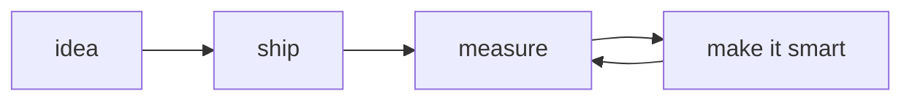

<!-- trace_id: luqman-ansari · sampled: always · exporter: github.com -->

```text
$ aeye trace --agent luqman-ansari --env production --follow
```

```log
[TRACE] agent.boot                     status=OK       region=islamabad-1
[SPAN ] education.fast_nuces           dur=4y          attrs={degree: "BS Computer Science", gpa: 3.57, deans_list: 6}
[SPAN ] role.emumba.genai_engineer     dur=ongoing     attrs={cloud: "AWS", focus: "agents-in-production"}
[INFO ] capability.loaded              rag_systems, llm_agents, fine_tuning, workflow_automation
[INFO ] runtime.loaded                 python, fastapi, pydantic_ai, pytorch, bedrock, sagemaker, lambda
[WARN ] observed: most systems fail from bad engineering, not bad models
[INFO ] remediation: ship it → measure it → then make it smart
[TRACE] agent.ready                    awaiting=interesting_problems
```

### ⛏ tool calls

```python
@agent.tool
def build(thing: ProductionSystem) -> Deployed:
    """RAG pipelines, LLM agents, serverless GenAI on AWS.
    Bedrock · SageMaker · Lambda. No demos that die in staging."""

@agent.tool
def observe(pipeline: PydanticAIPipeline) -> Insight:
    """See AeyeAgent ↓ — because you can't fix a black box."""
```

### ⛏ featured span: `AeyeAgent`

Open-source visual debugger & observability dashboard for **PydanticAI** agent pipelines.
Watch your agent think — every tool call, every retry, every wrong turn — as a live trace.

```text
pip install aeyeagent
```

→ [github.com/Luqman-Ansari/AeyeAgent](https://github.com/Luqman-Ansari) · on [PyPI](https://pypi.org/project/aeyeagent/)

### ⛏ pipeline



### ⛏ final output

```json
{
  "name": "Luqman Ansari",
  "role": "AWS GenAI Engineer @ Emumba",
  "location": "Islamabad, Pakistan",
  "accepts": ["hard problems", "agent observability nerdery", "coffee"],
  "links": {
    "github": "https://github.com/Luqman-Ansari",
    "linkedin": "https://linkedin.com/in/luqman-ansari"
  }
}
```

<sub><code>trace complete · 0 errors · 1 warning (by design)</code></sub>
