<!-- Profile README for github.com/Luqman-Ansari -->
<!-- Repo must be named exactly "Luqman-Ansari" for this to render on your profile -->

<p align="center">
  
</p>

<p align="center">
  <a href="https://readme-typing-svg.demolab.com">
    
  </a>
</p>

<p align="center">
  
  
  
</p>

---

```python
class LuqmanAnsari:
    role        = "AWS GenAI Engineer @ Emumba"
    location    = "Islamabad, Pakistan"
    focus       = ["RAG systems", "LLM agents", "serverless GenAI", "automations"]
    shipping    = "enterprise-grade AI pipelines, fine-tuned models, voice agents"
    philosophy  = "ship it -> measure it -> then make it smart"

    def currently(self):
        return "architecting scalable RAG & LLM agents on AWS Bedrock + SageMaker"
```

I'm an AI engineer who cares more about the **engineering** than the demo. I build
RAG systems, LLM-powered agents, and serverless GenAI on AWS that actually hold up
in production — and automations that quietly delete the manual work nobody wanted to do.

---

### 🧠 GenAI &amp; LLMs


### ☁️ AWS &amp; Cloud


### 🛠️ Languages &amp; Tools


---

## 🚀 Featured Work

<table>
  <tr>
    <td width="50%" valign="top">

### [`AeyeAgent`](https://github.com/Luqman-Ansari/AeyeAgent) &nbsp;<sub>OSS · on PyPI</sub>
Visual debugger &amp; observability dashboard for **PydanticAI** agent pipelines.
Instruments agents via OpenTelemetry, stores every span locally, and serves a
React dashboard — run graph, timeline, inspector, topology — in two lines of code.

`Python` · `OpenTelemetry` · `PydanticAI` · `React`
[**GitHub →**](https://github.com/Luqman-Ansari/AeyeAgent) · [**PyPI →**](https://pypi.org/project/aeyeagent/)

  </td>
    <td width="50%" valign="top">

### MunnaGPT Chatbot &nbsp;<sub>Serverless · AWS</sub>
Serverless chatbot on **Lambda + API Gateway + DynamoDB + S3**. RAG pipelines for
contextual accuracy, **Amazon Bedrock** for responses, **Polly** for natural voice.

`Bedrock` · `Lambda` · `RAG` · `Polly`

  </td>
  </tr>
  <tr>
    <td width="50%" valign="top">

### AI Project Management Agent &nbsp;<sub>LLM Agent</sub>
LLM agent automating task generation, scheduling &amp; orchestration across
**Google Calendar, Meet, Trello, ChromaDB** on a FastAPI backend.
**+70% task accuracy, +40% efficiency.**

`LLMs` · `FastAPI` · `RAG` · `ChromaDB`

  </td>
    <td width="50%" valign="top">

### Geotagging US Roadway Assets &nbsp;<sub>Deep Learning · R&amp;D</sub>
Geotagging roadway assets from 2D imagery. Refined depth-estimation across weather
and compensated for missing LiDAR — **error margin under 7 ft.**

`PyTorch` · `TensorFlow` · `Deep Learning`

  </td>
  </tr>
</table>

<p align="center"><a href="https://Luqman-Ansari.github.io/My-Portfolio"><b>↗ See all projects on my portfolio</b></a></p>

---

## 📊 GitHub Stats

<p align="center">
  
  
</p>

<p align="center">
  
</p>

<!-- Snake animation (eats your contribution graph).
     Powered by the GitHub Action in .github/workflows/snake.yml.
     This image 404s until that workflow has run once and created the "output" branch. -->
<p align="center">
  
</p>

---

## 🎓 Education

**B.S. Computer Science** — FAST NUCES · GPA **3.57** · **Dean's List 6×** · 2021–2025

---

## 🤝 Connect

<p align="center">
  <a href="https://www.linkedin.com/in/luqman-ansari"></a>
  <a href="https://github.com/Luqman-Ansari"></a>
  <a href="https://Luqman-Ansari.github.io/My-Portfolio"></a>
  <a href="mailto:luqmanansari0002@gmail.com"></a>
</p>

<p align="center"><sub><code>// most systems fail from bad engineering, not bad models — ship it, measure it, then make it smart</code></sub></p>
